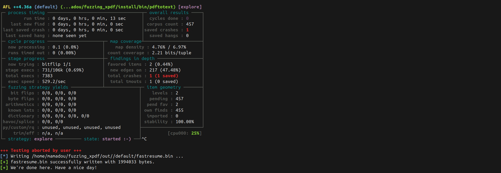
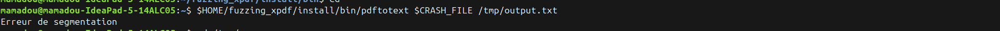
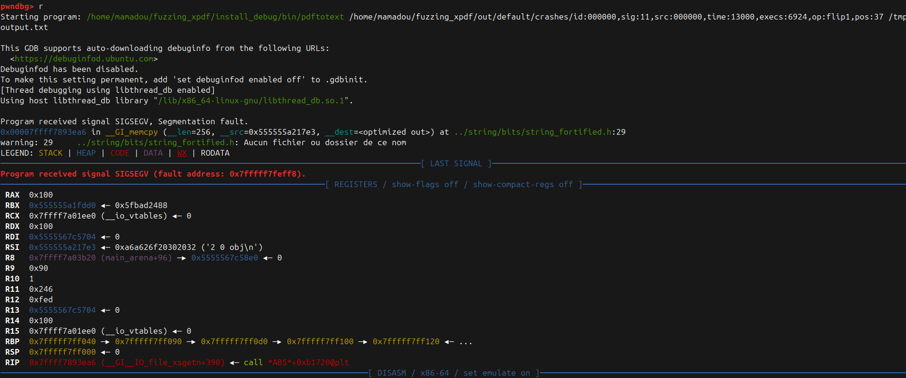

# Write-up Fuzzing AFL++ et Correction de Xpdf 3.02

## Environnement et Setup

### Installation d'AFL++

```bash
# Cloner AFL++
git clone https://github.com/AFLplusplus/AFLplusplus
cd AFLplusplus

# Compiler
make distrib

# Ajouter au PATH
export PATH=$PATH:$HOME/AFLplusplus
export AFL_PATH=$HOME/AFLplusplus
```

### Configuration système

```bash
# Désactiver le core dump externe (requis par AFL)
echo core | sudo tee /proc/sys/kernel/core_pattern

# Configuration permanente
sudo bash -c 'cat > /etc/sysctl.d/50-afl.conf << EOF
kernel.core_pattern=core
kernel.core_uses_pid=1
EOF'
sudo sysctl -p /etc/sysctl.d/50-afl.conf
```

### Compilation de Xpdf avec instrumentation AFL

```bash
# Créer la structure de répertoires
mkdir -p $HOME/fuzzing_xpdf
cd $HOME/fuzzing_xpdf

# Télécharger Xpdf 3.02
wget https://dl.xpdfreader.com/old/xpdf-3.02.tar.gz
tar -xvzf xpdf-3.02.tar.gz
cd xpdf-3.02

# Compiler avec AFL
export CC=$HOME/AFLplusplus/afl-gcc-fast
export CXX=$HOME/AFLplusplus/afl-g++-fast

./configure --prefix=$HOME/fuzzing_xpdf/install
make clean
make
make install
```

---

## Fuzzing avec AFL++

### Préparation du corpus initial

```bash
# Créer un répertoire pour les seeds
mkdir -p $HOME/fuzzing_xpdf/pdf_examples

# Seed à y placer
wget https://github.com/mozilla/pdf.js-sample-files/raw/master/helloworld.pdf
wget https://www.w3.org/WAI/ER/tests/xhtml/testfiles/resources/pdf/dummy.pdf

### 3.2 Lancement du fuzzing

```bash
# Configurer l'environnement
export AFL_SKIP_CPUFREQ=1

# Lancer AFL++
afl-fuzz -i $HOME/fuzzing_xpdf/pdf_examples/ \
         -o $HOME/fuzzing_xpdf/out/ \
         -s 123 \
         -- $HOME/fuzzing_xpdf/install/bin/pdftotext @@ \
            $HOME/fuzzing_xpdf/output
```

### Résultats du fuzzing



**Statistiques** :
- Durée : ~13 secondes
- Exécutions : 6924
- Crashes trouvés : 1
- Mutation : `flip1` (bit flip à la position 37)

**Fichier crash généré** :
```
    id:000000,sig:11,src:000000,time:13000,execs:6924,op:flip1,pos:37
```

---

## Reproduction du Crash

### Localiser le fichier de crash

```bash
# Lister les crashes
ls -lh $HOME/fuzzing_xpdf/out/default/crashes/
```

### Reproduire le crash manuellement

```bash
# Définir la variable
CRASH_FILE=$HOME/fuzzing_xpdf/out/default/crashes/id:000000*

# Reproduire
$HOME/fuzzing_xpdf/install/bin/pdftotext $CRASH_FILE /tmp/output.txt
```


**Crash reproduit avec succès**

### Examiner le fichier malformé

```bash
xxd $CRASH_FILE | head -50
```

**Output (extrait)** :
```
00000000: 2550 4446 2d31 2e34 0a25 c3a4 c3bc c3b6  %PDF-1.4.%......
00000010: c39f 0a32 2030 206f 626a 0a3c 3c2f 4c65  ...2 0 obj.<</Le
00000020: 6e67 7468 2032 2030 2052 2f46 696c 7465  ngth 2 0 R/Filte
                    ^^^^^^^^^^
                    RÉFÉRENCE CIRCULAIRE !
```

**Analyse** :
- L'objet #2 contient `/Length 2 0 R`
- Cela signifie : "La longueur de l'objet #2 est définie dans l'objet #2"
- C'est une **référence circulaire** !

---

## Debugging et Analyse

### Compilation avec symboles de debug

```bash
cd $HOME/fuzzing_xpdf/xpdf-3.02

# Nettoyer
make clean

# Compiler avec debug symbols
export CC=$HOME/AFLplusplus/afl-gcc-fast
export CXX=$HOME/AFLplusplus/afl-g++-fast
export CFLAGS="-g -O0"
export CXXFLAGS="-g -O0"

./configure --prefix=$HOME/fuzzing_xpdf/install_debug
make
make install
```

### Analyse avec GDB

```bash
# Lancer GDB
gdb --args $HOME/fuzzing_xpdf/install_debug/bin/pdftotext \
  $CRASH_FILE /tmp/output.txt
```

**Commandes GDB** :
```gdb
(gdb) run
# ... Program crashes ...
```


**Backtrace obtenu** :
```
(gdb) set backtrace limit 20
(gdb) backtrace
#0  0x00007ffff7893ea6 in memcpy
#1  0x00007ffff788649b in _IO_fread
#2  0x00007ffff788649b in _IO_fread
#3  0x00005555556e08fb in FileStream::fillBuf() at Stream.cc:641
#4  0x00005555556ff776 in FileStream::getChar()
#5  0x00005555556c5eb5 in Object::streamGetChar()
#6  0x00005555556b477d in Lexer::getChar() at Lexer.cc:92
#7  0x00005555556b4966 in Lexer::getObj() at Lexer.cc:124
#8  0x00005555556cea5a in Parser::Parser() at Parser.cc:29
#9  0x0000555555737287 in XRef::fetch(num=2, gen=0) at XRef.cc:810
#10 0x00005555556c39ec in Object::fetch()
#11 0x00005555555bc271 in Dict::lookup(key="Length")
#12 0x00005555556c5bff in Object::dictLookup(key="Length")
#13 0x00005555556d0c11 in Parser::makeStream()
#14 0x00005555556cfc22 in Parser::getObj()
#15 0x00005555557378db in XRef::fetch(num=2, gen=0) at XRef.cc:823
#16 0x00005555556c39ec in Object::fetch()
#17 0x00005555555bc271 in Dict::lookup(key="Length")
#18 0x00005555556c5bff in Object::dictLookup(key="Length")
#19 0x00005555556d0c11 in Parser::makeStream(objNum=2)
```

**Observation critique** :
- Frames #9 et #15 : `XRef::fetch(num=2)` appelé **deux fois**
- Frames #11 et #17 : `Dict::lookup("Length")` appelé **deux fois**
- **RÉCURSION INFINIE détectée !**

### Examiner les paramètres au moment du crash

```gdb
(gdb) frame 3
#3 FileStream::makeSubStream (this=0x555555a20000, startA=19, 
    limitedA=0, lengthA=0, dictA=0x7fffff7ff150)

(gdb) info args
this = 0x555555a20000
startA = 19
limitedA = 0
lengthA = 0        ← PROBLÈME : longueur NULLE !
dictA = 0x7fffff7ff150
```

---

## . Root Cause Analysis

### Vulnérabilité #1 : Récursion infinie

**Fichier** : `xpdf/XRef.cc:808`  
**Fonction** : `Object *XRef::fetch(int num, int gen, Object *obj)`

```cpp
// Code vulnérable (ligne 808)
parser = new Parser(this,
       new Lexer(this,
         str->makeSubStream(start + e->offset, gFalse, 0, &obj1)),
       gTrue);
parser->getObj(obj, ...);
```

**Problème** :
- Pas de vérification si `num` est déjà en cours de parsing
- Si objet #2 contient `/Length 2 0 R`, cela crée une boucle infinie :

```
XRef::fetch(2)
  → Parser lit objet #2
    → Trouve "/Length 2 0 R"
      → Object::fetch() appelle XRef::fetch(2)
        → Parser lit objet #2 ENCORE
          → Trouve "/Length 2 0 R" ENCORE
            → XRef::fetch(2) ENCORE
              → ... INFINI
```

### Vulnérabilité #2 : Pas de validation de longueur

**Fichier** : `xpdf/Stream.cc:594`  
**Fonction** : `Stream *FileStream::makeSubStream(...)`

```cpp
// Code vulnérable (ligne 594)
Stream *FileStream::makeSubStream(Guint startA, GBool limitedA,
                                  Guint lengthA, Object *dictA) {
  return new FileStream(f, startA, limitedA, lengthA, dictA);
  // ← Aucune validation de lengthA !
}
```

**Problème** :
- Accepte `lengthA = 0` sans vérification
- Crée un `FileStream` avec une longueur invalide
- Plus tard, `fillBuf()` tente de lire des données avec cet état corrompu

### Vulnérabilité #3 : Buffer over-read

**Fichier** : `xpdf/Stream.cc:641`  
**Fonction** : `GBool FileStream::fillBuf()`

```cpp
// Code vulnérable (lignes 633-641)
if (limited && bufPos >= start + length) {
  return gFalse;
}
if (limited && bufPos + fileStreamBufSize > start + length) {
  n = start + length - bufPos;
} else {
  n = fileStreamBufSize;  // Toujours 256 si limited=FALSE
}
n = fread(buf, 1, n, f);  // Lit n octets sans vérification
```

**Problème** :
- Si `limited = FALSE` (notre cas) et `length = 0`, les vérifications sont sautées
- Lit `fileStreamBufSize` (256 octets) peu importe la longueur réelle du stream
- Peut lire au-delà de la fin du fichier → corruption mémoire
---

## Correction des Vulnérabilités

### Patch #1 : Détection de récursion dans XRef::fetch

**Fichier** : `xpdf/XRef.cc`

** fonction `XRef::fetch`** (autour de la ligne 750) :

```cpp
Object *XRef::fetch(int num, int gen, Object *obj) {
  XRefEntry *e;
  Parser *parser;
  Object obj1, obj2, obj3;
  
  // PATCH #1 : Détection de récursion circulaire
  static int fetchDepth = 0;
  static int fetchingObjects[1000];
  
  // Vérifier la profondeur maximale
  if (fetchDepth > 50) {
    error(-1, "Maximum recursion depth exceeded while fetching object %d %d", num, gen);
    return obj->initNull();
  }
  
  // Vérifier si l'objet est déjà en cours de parsing
  if (num >= 0 && num < 1000 && fetchingObjects[num]) {
    error(-1, "Circular reference detected for object %d %d", num, gen);
    return obj->initNull();
  }
  
  fetchDepth++;
  if (num >= 0 && num < 1000) {
    fetchingObjects[num] = 1;
  }

  // ... code original continue ...

  // À la fin de la fonction, avant chaque return, ajouter :
  fetchDepth--;
  if (num >= 0 && num < 1000) {
    fetchingObjects[num] = 0;
  }
  
  return obj;
}
```

### Patch #2 : Validation de longueur dans makeSubStream

**Fichier** : `xpdf/Stream.cc`


**la fonction `FileStream::makeSubStream` (ligne 594) :**

**AVANT** :
```cpp
Stream *FileStream::makeSubStream(Guint startA, GBool limitedA,
                                  Guint lengthA, Object *dictA) {
  return new FileStream(f, startA, limitedA, lengthA, dictA);
}
```

**APRÈS** :
```cpp
Stream *FileStream::makeSubStream(Guint startA, GBool limitedA,
                                  Guint lengthA, Object *dictA) {
  // PATCH #2 : Validation de la longueur
  if (lengthA == 0 || lengthA > 0x7FFFFFFF) {
    error(-1, "Invalid stream length: %u at offset %u", lengthA, startA);
    return NULL;
  }
  
  // Protection contre les overflows d'offset
  if (limitedA && startA + lengthA < startA) {
    error(-1, "Stream offset overflow: start=%u, length=%u", startA, lengthA);
    return NULL;
  }
  
  return new FileStream(f, startA, limitedA, lengthA, dictA);
}
```

### Patch #3 : Vérification de bounds dans fillBuf

**Même fichier** : `xpdf/Stream.cc`

**`FileStream::fillBuf` (ligne 630) :**

**AVANT** :
```cpp
GBool FileStream::fillBuf() {
  int n;
  
  bufPos += bufEnd - buf;
  bufPtr = bufEnd = buf;
  if (limited && bufPos >= start + length) {
    return gFalse;
  }
  if (limited && bufPos + fileStreamBufSize > start + length) {
    n = start + length - bufPos;
  } else {
    n = fileStreamBufSize;
  }
  n = fread(buf, 1, n, f);
  bufEnd = buf + n;
  if (bufPtr >= bufEnd) {
    return gFalse;
  }
  return gTrue;
}
```

**APRÈS** :
```cpp
GBool FileStream::fillBuf() {
  int n;
  
  bufPos += bufEnd - buf;
  bufPtr = bufEnd = buf;
  
  // PATCH #3 : Vérification même si limited=FALSE
  if (limited && bufPos >= start + length) {
    return gFalse;
  }
  
  if (limited && bufPos + fileStreamBufSize > start + length) {
    n = start + length - bufPos;
    // Vérification supplémentaire
    if (n <= 0) {
      return gFalse;
    }
  } else {
    n = fileStreamBufSize;
  }
  
  // Vérification de validité avant fread
  if (n <= 0 || n > fileStreamBufSize) {
    error(-1, "Invalid buffer size in fillBuf: %d", n);
    return gFalse;
  }
  
  n = fread(buf, 1, n, f);
  bufEnd = buf + n;
  if (bufPtr >= bufEnd) {
    return gFalse;
  }
  return gTrue;
}
```

---

## 8. Vérification du Fix

### 8.1 Recompilation avec les patches

```bash
cd $HOME/fuzzing_xpdf/xpdf-3.02

# Nettoyer
make clean

# Recompiler
export CC=$HOME/AFLplusplus/afl-gcc-fast
export CXX=$HOME/AFLplusplus/afl-g++-fast

./configure --prefix=$HOME/fuzzing_xpdf/install_patched
make
make install
```

### Test avec le fichier crash original

```bash
# Tester le binaire patché
CRASH_FILE=$HOME/fuzzing_xpdf/out/default/crashes/id\:000000,sig\:11,src\:000000,time\:13075,execs\:6924,op\:flip1,pos\:37
$HOME/fuzzing_xpdf/install_patched/bin/pdftotext \
  $CRASH_FILE \
  /tmp/output.txt

echo "Exit code: $?"
```

**Résultat attendu** :
```
Error: Circular reference detected for object 2 0
Exit code: 1
```

**Plus de crash ! Le programme termine proprement avec un message d'erreur.**