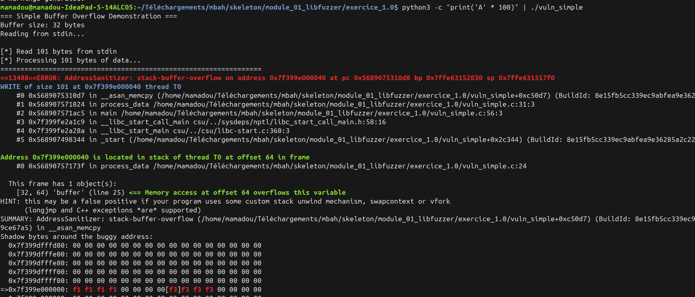

# Exo 1.0
# Write-up : stack-buffer-overflow dans vuln_simple

## Input déclencheur
Une chaîne de 101 octets (100 'A' + newline) envoyée via stdin :
python3 -c "print('A' * 100)" | ./vuln_simple

## Type de bug
Stack Buffer Overflow (WRITE)

## Localisation
- Fonction : process_data()
- Fichier : vuln_simple.c
- Ligne du overflow : 31 (appel à memcpy)
- Ligne de déclaration du buffer : 25

## Reproductibilité
Reproductible de manière fiable avec toute entrée supérieure à 32 octets :
```python
    python3 -c "print('A' * 33)" | ./vuln_simple
```
33 octets suffisent à déclencher le crash (32 = taille du buffer + 1 octet dépasse déjà).

## Cause racine
Le buffer est déclaré avec une taille fixe de 32 octets (ligne 25),
mais **process_data()** fait un **memcpy()** de la totalité des données lues
depuis stdin (101 octets) dans ce buffer sans vérifier la taille avant traitement. Il n'y a aucune comparaison entre la taille de l'input et la taille du buffer avant la copie.

La ligne clé est la ligne 31 :
```python
    memcpy(buffer, input, size);  // size = 101, buffer = 32 bytes
```

## Correction proposée
Limiter la copie à la taille du buffer :
```python
    memcpy(buffer, input, size < sizeof(buffer) ? size : sizeof(buffer));
```
Ou mieux, utiliser **strncpy(..)** et une vérification explicite avant :
```python
    if (size > sizeof(buffer)) {
        fprintf(stderr, "Input trop grand (%zu bytes), max %zu\n", size, sizeof(buffer));
        return;
    }
    memcpy(buffer, input, size);
```

