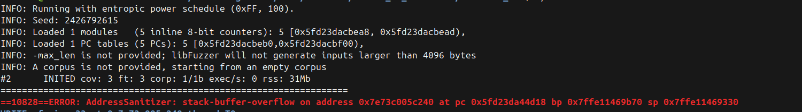
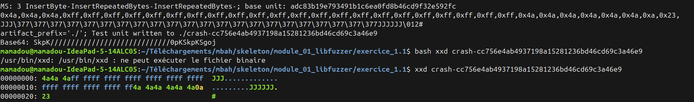

# Write-up : Exercice 1.1 - Premier harness libFuzzer

## Input déclencheur
Le fichier crash sauvegardé automatiquement par libFuzzer :
```python
    ./crash-cc756e4ab4937198a15281236bd46cd69c3a46e9
    Contenu (via xxd) : 33 octets composés de bytes 0x4a, 0xff, 0x0a et 0x23.
```
C'est le minimum pour dépasser le buffer de 32 octets.

## Type de bug
Stack Buffer Overflow (WRITE de 33 octets dans un buffer de 32)

## Localisation
- Fonction : process_data()
- Fichier : vuln_func.c
- Ligne du overflow : 16 (memcpy sans vérification de taille)
- Ligne de déclaration du buffer : 13
- Appelé depuis : LLVMFuzzerTestOneInput() à harness_simple.c:70

## Reproductibilité
Reproductible de manière fiable en rejouant le fichier crash :
```python
    ./fuzzer ./crash-cc756e4ab4937198a15281236bd46cd69c3a46e9
```
Le fuzzer ne mute pas, il rejoue l'input une seule fois et le crash
est identique à chaque exécution.

## Cause racine
**process_data()** fait un **memcpy()** de la totalité des données reçues
dans un buffer de taille fixe **(32 octets)** sans jamais vérifier que
la taille de l'input ne dépasse pas **BUFFER_SIZE**. **33 octets** suffit
à déclencher le crash.

```python
La ligne clé (vuln_func.c:16) :
    memcpy(buffer, data, data_size);  // data_size peut être > 32
```
## Correction proposée
Vérifier la taille avant la copie :
```python
    if (data_size > BUFFER_SIZE) {
        return;  // ou truncate à BUFFER_SIZE
    }
    memcpy(buffer, data, data_size);
```

---

## Compréhension de la sortie du fuzzer

### Status line
```python
    #2  INITED cov: 3 ft: 3 corp: 1/1b exec/s: 0 rss: 31Mb
```
- #2 : deuxième exécution du fuzzer
- INITED : initialisation terminée, le fuzzer commence à muter
- cov: 3 : 3 blocs de code atteints **(couverture)**
- ft: 3 : 3 features trouvées (métrique plus fine que cov,
  utilisée par le power schedule entropic)
- corp: 1/1b : 1 input dans le corpus, 1 byte au total
- exec/s: 0 : compteur pas encore mis à jour (venait de démarrer)
- rss: 31Mb : mémoire utilisée par le processus



### Mutations effectuées
```python
    MS: 3 InsertByte-InsertRepeatedBytes-InsertRepeatedBytes-
```


LibFuzzer a fait **3 mutations** à partir d'un corpus vide :
il a inséré un byte, puis répété des bytes deux fois, jusqu'à
atteindre **33 octets** et déclencher le crash. Il n'a pas besoin de
savoir que 32 était la limite — il l'a découvert par couverture.

### Le crash trouvé automatiquement
Le fuzzer a trouvé le bug en 3 mutations seulement parce que la
condition de crash était simple : juste dépasser 32 octets.
LibFuzzer a sauvegardé automatiquement l'input dans un fichier
**crash-\*** pour permettre la reproduction.