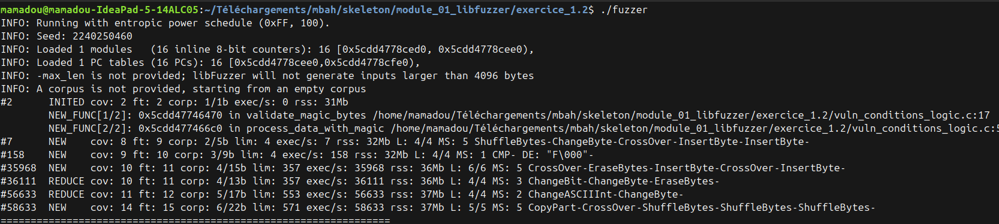
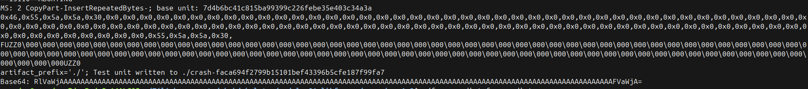

# Write-up : Exercice 1.2 - Fuzzing avec conditions complexes (Magic Bytes)

## Input déclencheur
Le fichier crash sauvegardé automatiquement par libFuzzer :
```
    ./crash-faca694f2799b15101bef43396b5cfe187f99fa7
```

    Contenu : 107 octets commençant par les magic bytes FUZZ (0x46, 0x55,
    0x5a, 0x5a), suivis de 103 octets de données (principalement des 0x00).
    Les 4 magic bytes sont nécessaires pour atteindre le memcpy vulnérable.

## Type de bug
Stack Buffer Overflow (WRITE de 103 octets dans un buffer de 16)

## Localisation
- Fonction : process_data_with_magic()
- Fichier : vuln_conditions_logic.c
- Ligne du overflow : 86 (memcpy sans vérification de taille)
- Ligne de déclaration du buffer : 56
- Validation des magic bytes : validate_magic_bytes(), ligne 17

## Reproductibilité
Reproductible de manière fiable en rejouant le fichier crash :
```
    ./fuzzer ./crash-faca694f2799b15101bef43396b5cfe187f99fa7
```

Ou manuellement avec n'importe quel input commençant par FUZZ et
d'une taille > 20 octets (4 magic bytes + plus de 16 octets de données).

## Cause racine
Le crash ne se déclenche que si les 4 premiers bytes sont exactement
**FUZZ**. Une fois cette validation passée, **process_data_with_magic()**
fait un **memcpy()** de **(size - 4)** octets dans un buffer de **16 octets**,
sans jamais vérifier que **(size - 4)** ne dépasse pas **BUFFER_SIZE**.

La ligne clé **(vuln_conditions_logic.c:86)** :
```c
    memcpy(buffer, data + 4, size - 4);  // (size - 4) peut être > 16
```

## Correction proposée
Vérifier la taille après les magic bytes avant la copie :
```c
    if ((size - 4) > BUFFER_SIZE) {
        return;  // ou truncate à BUFFER_SIZE
    }
    memcpy(buffer, data + 4, size - 4);
```
---

## Comment libFuzzer a trouvé les magic bytes

### Couverture
Le fuzzer a résolu le problème branche par branche :

    #2      INITED  cov: 2   -> Démarrage, corpus vide
    #7      NEW     cov: 8   -> Premières branches explorées
    #158    NEW     cov: 9   -> Trouvé 'F' (DE: "F\000"), première branche
                                de validate_magic_bytes() passée
    #35968  NEW     cov: 10  -> Nouvelle branche, continue à muter
    #56633  REDUCE  cov: 11  -> Affine l'input (ChangeASCIIInt)
    #58633  NEW     cov: 14  -> Tous les magic bytes trouvés, CRASH

En fuzzing aléatoire, la probabilité de trouver **FUZZ** est
**1 / 256^4 = 1 sur 4 milliards**. LibFuzzer a trouvé le crash en
**58 633** exécutions grâce à la couverture : chaque magic byte correct
ouvrait une nouvelle branche, donc l'input était gardé dans le corpus
et muté à partir de là. C'est exactement pourquoi le fuzzing guidé
par couverture existe.

### Rôle de DE: "F\000"
"DE" veut dire Dictionary Entry. LibFuzzer possède une liste interne
de bytes intéressants qu'il essaie comme mutations. Il a essayé 'F',
ça a ouvert une nouvelle branche, donc il a gardé cet input.

### Shadow memory
```bash
    =>0x7f8254fd0980: f5 f5 f5 f5 f5 f5 f5 f5 f1 f1 f1 f1 00 00[f3]f3
```
Le buffer ici fait **16 octets** (2 shadow bytes "00 00"), entouré du
left redzone **(f1)** et du right redzone **(f3)**. Le crash s'est produit
sur le **[f3]**, exactement à la limite du buffer.


---
